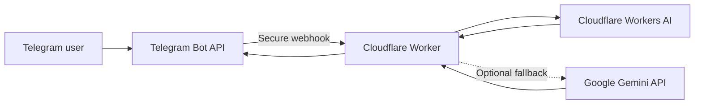

# BeautyCopy — Serverless AI Telegram Bot

BeautyCopy is a bilingual Telegram bot that creates e-commerce and social-media content for perfume products. It runs as a serverless Cloudflare Worker and uses Cloudflare Workers AI as its primary generation engine, with Gemini available as an optional fallback.

> BeautyCopy is exclusively a hobby project created for learning and demonstration purposes. It is not a commercial service.

## What it can generate

- Product descriptions for Allegro and online stores in Polish
- Amazon-ready product descriptions in English
- Instagram posts with hooks, calls to action and hashtags
- Fragrance alternative and dupe analyses
- Structured top, heart and base note profiles
- A complete **Campaign Pack / Kampania 360°**

### Campaign Pack

The Campaign Pack turns one perfume name into a coordinated marketing set:

- SEO-friendly product title
- Sales description
- Three key benefits
- Instagram post
- Call to action
- Hashtags
- SEO keywords
- Three advertising headlines

Users can choose between **Luxury**, **Minimal** and **Sales** tones.

## User experience

- Polish and English interface
- Telegram reply keyboards and guided prompts
- `/start` and `/help` commands
- Format and tone selection through buttons
- Automatic return to the main format menu after generation
- Clear bilingual API and quota error messages

## Architecture



The original prototype was created as a Make automation. It was later rebuilt as a standalone JavaScript application, so Make and Render are no longer required to keep the bot running.

## Technology

- JavaScript ES modules
- Cloudflare Workers
- Cloudflare Workers AI
- Telegram Bot API
- Google Gemini API fallback
- Webhooks and REST APIs
- Wrangler

## Project structure

```text
.
├── src/
│   └── index.js          # Telegram flow, prompts and AI generation
├── .dev.vars.example     # Local secret-variable template
├── .gitignore
├── package.json
├── package-lock.json
└── wrangler.jsonc        # Cloudflare Worker configuration
```

## Local setup

Requirements:

- Node.js 20 or newer
- A Cloudflare account with Workers AI access
- A Telegram bot created through BotFather
- An optional Gemini API key for fallback generation

Install the dependencies:

```bash
npm install
```

Copy `.dev.vars.example` to `.dev.vars` and replace the placeholder values. Never commit `.dev.vars`.

```env
TELEGRAM_BOT_TOKEN=replace_me
GEMINI_API_KEY=replace_me
TELEGRAM_WEBHOOK_SECRET=replace_with_a_long_random_string
```

Start a local development session:

```bash
npm run dev
```

## Cloudflare deployment

Store production credentials as encrypted Cloudflare Worker secrets:

```bash
npx wrangler secret put TELEGRAM_BOT_TOKEN
npx wrangler secret put GEMINI_API_KEY
npx wrangler secret put TELEGRAM_WEBHOOK_SECRET
```

Deploy the Worker:

```bash
npm run deploy
```

The Telegram webhook must target the Worker's `/telegram` route and use the same secret token stored in `TELEGRAM_WEBHOOK_SECRET`.

## Security and accuracy

- API credentials are stored as Cloudflare secrets and are not part of the repository.
- The webhook validates Telegram's secret-token header.
- User input is treated as product data, not as instructions.
- Generated copy avoids claims about live prices or availability.
- AI-generated product details should be verified before publication.
- Telegram HTML output is restricted to supported formatting tags.

## Current deployment

The production Worker exposes a small health endpoint at:

<https://beauty-perfume-ai.arsenii-beauty-ai.workers.dev/>

The endpoint contains no credentials and is separate from the secure Telegram webhook.

